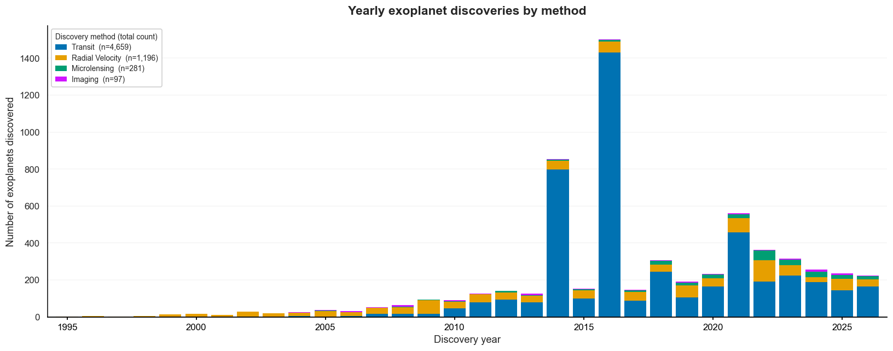
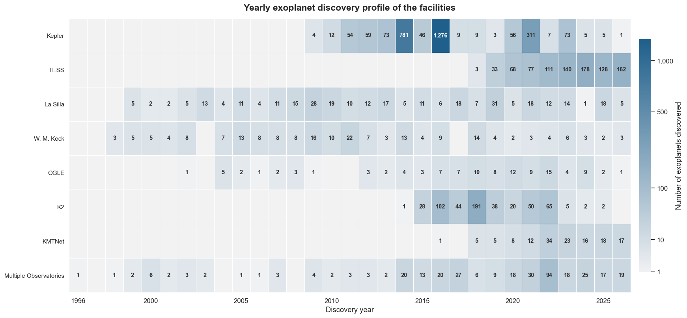
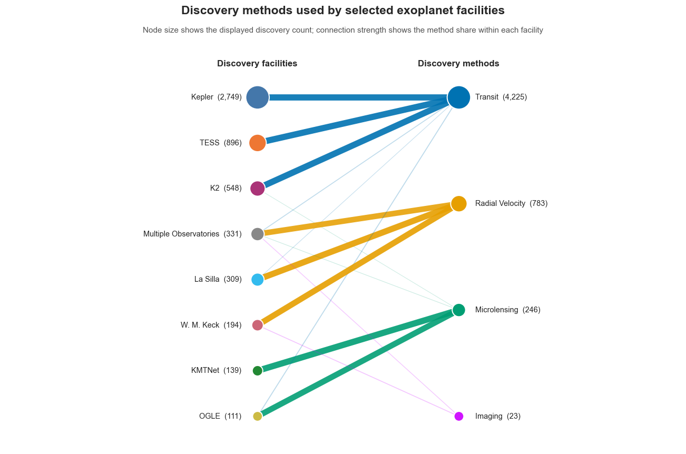
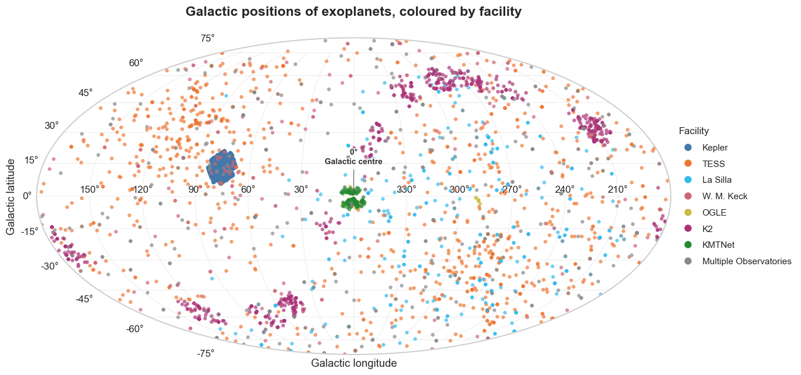
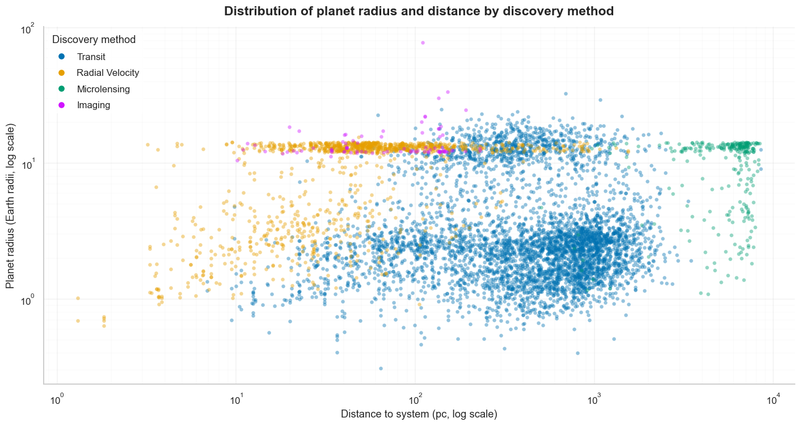
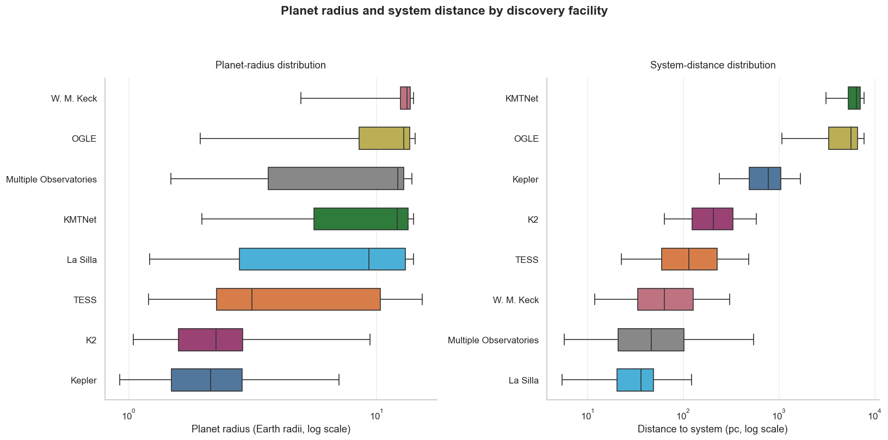
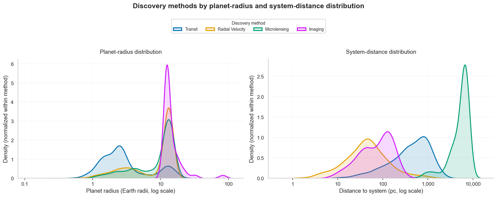
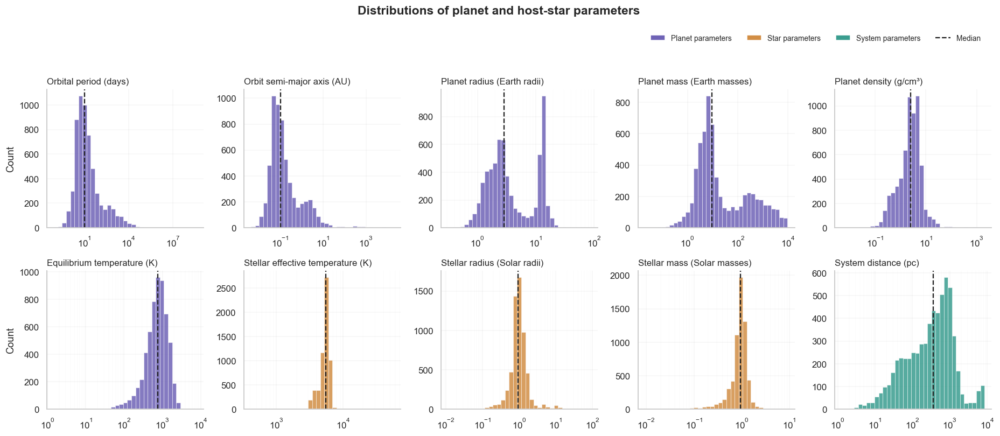
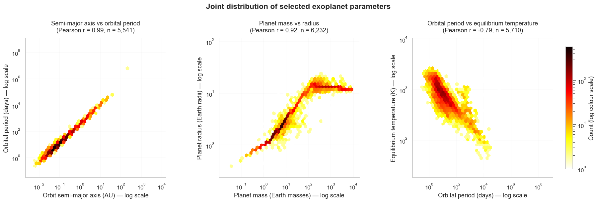
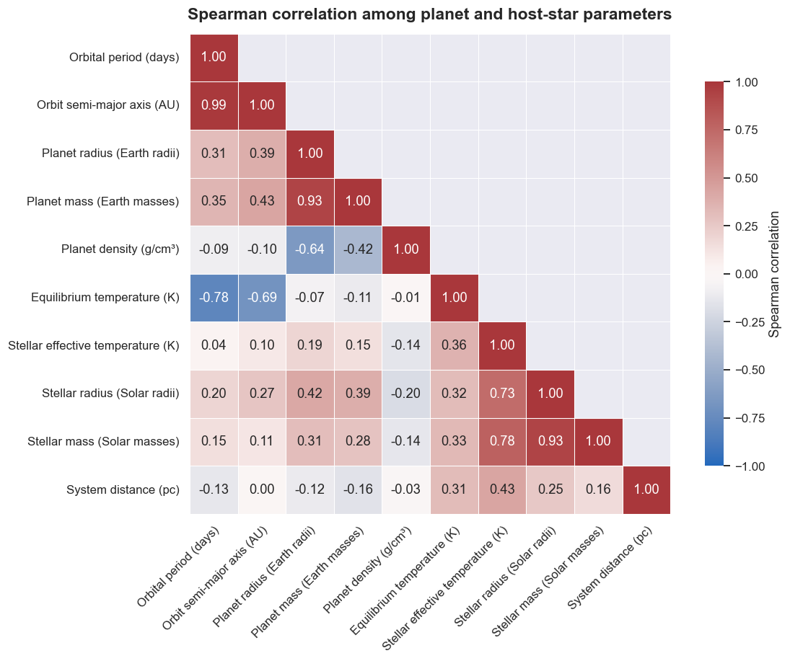

# NASA Exoplanet Visualization

> A visual exploration of known exoplanets and what they can reveal about our instruments, observational biases, and planetary systems beyond the Solar System.

This project explores data from the **NASA Exoplanet Archive** through scientific visualization, focusing on how exoplanets have been discovered, where they are observed, and how their physical properties relate to those of their host stars.

## Dataset

The data originates from the **NASA Exoplanet Archive**, using the
Planetary Systems Composite Parameters (**PSCompPars**) table.

For this project, the original dataset was processed and simplified.
Only a subset of the available parameters was included, and measurement
uncertainties were not considered.

Variables used in the analysis include:

- discovery year, method, and facility
- galactic longitude and latitude
- orbital period and semi-major axis
- planet radius, mass, density, and equilibrium temperature
- host-star effective temperature, radius, and mass
- system distance

Source: [NASA Exoplanet Archive – PSCompPars](https://exoplanetarchive.ipac.caltech.edu/cgi-bin/TblView/nph-tblView?app=ExoTbls&config=PSCompPars)

## Visual Exploration

The known exoplanet population is shaped not only by what exists in the Galaxy, but also by what our detection methods can see.

Transit surveys, radial-velocity measurements, and different observing facilities each sample planetary systems in different ways. These differences shape the patterns we see in discovery history, sky coverage, orbital properties, and the types of planets represented in the dataset.

The visualizations follow that story from several angles:

**time → detection method → observing facility → galactic position → planetary properties → host-star properties**

## 1. A Timeline of Discovery

Exoplanet discovery did not grow steadily. Instead, the timeline shows distinct bursts, each reflecting changes in observing technology, survey design, and how astronomers confirmed planet candidates.

### How exoplanet discovery methods changed over time

The earliest part of the dataset is dominated by **radial velocity**, the technique that detects the small back-and-forth motion of a star caused by an orbiting planet. This fits the field's history: 51 Pegasi b, discovered in 1995 by radial velocity, helped launch the modern era of exoplanet detection.[^3]

The picture changes dramatically after the arrival of large transit surveys. In this dataset, 4,659 planets were discovered by transit, compared with 1,196 by radial velocity, 281 by microlensing, and 97 by imaging.

Two years immediately stand out: **2014 and 2016**. Rather than reflecting a sudden surge in planets in those years, these peaks reflect large surveys' ability to detect and validate planets in bulk. NASA announced 715 newly verified Kepler planets in 2014, followed by a record batch of 1,284 in 2016.[^1][^2]

> **Note:** A discovery timeline is therefore not only a history of planets, but also a history of telescopes, detection algorithms, validation pipelines, and how candidate signals are identified and validated as confirmed exoplanets.

### The observatories behind the discoveries

Looking at discovery facilities makes these technological eras even clearer.

Ground-based observatories such as **La Silla** and **W. M. Keck** appear across a long stretch of the timeline, reflecting their continuing role in exoplanet searches. **Kepler**, in contrast, produces a highly concentrated burst of discoveries after its 2009 launch, including the enormous peaks visible in 2014 and 2016.

After problems with Kepler's pointing system, the telescope was repurposed as the **K2 mission** in 2014. Its contribution forms another distinct block in the timeline rather than the long continuous pattern seen from ground-based observatories.[^8]

A new phase becomes visible from 2018 onward with **TESS**. Unlike Kepler's long focus on one region of the sky, TESS was designed as an all-sky transit survey targeting nearby, bright stars. Its growing contribution in the later years marks another shift in how the exoplanet population is being sampled.[^7]

Interestingly, Kepler-linked discoveries continue to appear in the dataset even after the spacecraft stopped operating. A telescope can stop collecting photons while its scientific life continues: archived observations can still produce new planet discoveries years later.[^11]

**The timeline is therefore a map of technological change as much as it is a count of planets.**

## 2. Who Finds the Planets?

Different observatories contribute to the known exoplanet population in different ways. Their instruments, observing strategies, and scientific goals make them sensitive to different detection methods.

The separation in the network is striking. **Kepler, K2, and TESS are significantly associated with transit discoveries**, while **La Silla and W. M. Keck Observatory are connected to radial velocity**. At the other end, **OGLE and KMTNet are dominated by microlensing discoveries**.

This reflects how these surveys were designed.

NASA's Kepler and TESS missions search for the tiny decrease in stellar brightness that occurs when a planet passes in front of its host star. Kepler and K2 have discovered thousands of planets using this transit technique, and TESS uses it as its primary detection method.[^3]

La Silla tells a very different story. The observatory hosts **HARPS — the High Accuracy Radial velocity Planet Searcher**, an instrument specifically designed to detect the small changes in a star's radial velocity caused by the gravitational pull of an orbiting planet.[^4]

Meanwhile, the strong **OGLE–KMTNet–microlensing** branch offers another way to find planets. Microlensing searches look for temporary magnification of a background star caused by the gravity of an intervening object. Both OGLE and KMTNet maintain large microlensing surveys, particularly toward dense stellar regions of the Milky Way.[^5]

> **Note:** The known exoplanet dataset is therefore not a neutral census of every type of planet. It is partly a fingerprint of the instruments and observing strategies used to build it.

## 3. Where Are Exoplanets Found in the Sky?

The sky map reveals something interesting: **the detected exoplanets are not spread uniformly across the sky**.

Part of that structure comes from the missions' observing footprints themselves.

**Kepler forms a very compact cluster** because the original mission repeatedly monitored a single field in the Cygnus–Lyra region rather than surveying the whole sky. NASA describes Kepler's original field as roughly 100 square degrees centred on that fixed region.[^6]

**TESS looks completely different.** Its detections are scattered across a much broader area because TESS was designed to survey almost the entire sky in successive observing sectors. The primary mission divided the sky into 26 sectors, with each observed for about 27 days.[^7]

The multiple patches associated with **K2** tell another part of the story. After the original Kepler mission lost the ability to maintain its previous pointing, K2 observed a succession of fields along the ecliptic, moving to a new field approximately every three months. That observing strategy naturally leaves a series of discrete footprints rather than one compact region.[^8]

Near the **Galactic centre**, another concentration becomes visible, particularly for the microlensing-oriented surveys. This region contains an exceptionally high density of stars, making it particularly valuable for gravitational microlensing searches: more background stars mean more opportunities for foreground systems to temporarily magnify them. For this reason, NASA's Roman microlensing survey is designed to monitor the dense Galactic bulge.[^9]

> **Note:** A sky map of known exoplanets is not the same thing as a map of where planets truly are most common. It is also a map of where telescopes looked, for how long, and with which detection technique.

In other words, some of the most obvious structures in the dataset are not necessarily astrophysical structures; they are the geometric footprints of our observing strategies.

## 4. The Detection Footprint

The known exoplanet population spans an enormous range of planetary sizes and distances from Earth — but different discovery methods do not sample that space equally.

### Planet size and distance by discovery method

The separation between discovery methods is obvious.

**Transit discoveries dominate the dataset**, particularly among planets with radii of only a few Earth radii. Their systems span a broad range of distances, reflecting the large-scale transit surveys that make up much of the modern known exoplanet population.

**Radial-velocity discoveries are concentrated toward comparatively nearby systems.** This makes sense: the method relies on measuring tiny Doppler shifts in a host star's spectrum, so bright, well-observed nearby stars are especially valuable targets.

At the opposite extreme, **microlensing discoveries occupy some of the most distant systems in the dataset**, reaching several thousand parsecs away.

Interestingly, **directly imaged planets cluster toward large planetary radii**. Direct imaging is extraordinarily difficult because a planet must be separated from its host star's glare, making young, luminous giant planets much easier targets than small rocky planets.[^11]

### The same bias appears in the observatories

The facility-level distributions reveal the same structure from another angle.

Kepler and K2 contribute many of the **smaller-radius planets**, while facilities associated with radial-velocity and microlensing surveys tend toward larger recorded planet radii.

The distance distributions are even more distinctive. **TESS, La Silla, and W. M. Keck Observatory** predominantly contribute relatively nearby systems, whereas **OGLE and KMTNet** occupy the far end of the distance scale.

That contrast reflects survey design as much as astrophysics. TESS was specifically designed to search nearby, bright stars; NASA describes its targets as typically much closer and brighter than those observed by Kepler.[^7]

OGLE and KMTNet, meanwhile, are strongly associated with gravitational microlensing. Microlensing surveys often monitor extremely dense stellar fields toward the Galactic bulge, allowing planets thousands of parsecs away to appear in the dataset.[^5]

### Each method sees a different slice of the population

Normalizing each discovery method makes the contrast even easier to see.

The **transit distribution peaks at much smaller planetary radii**, while imaging is concentrated strongly around giant planets. Radial velocity and microlensing occupy intermediate and overlapping regions of the radius distribution.

The system-distance distributions separate even more:

- radial-velocity discoveries are concentrated toward nearby systems
- transit discoveries extend farther outward
- imaging remains comparatively local
- microlensing forms a distinct population thousands of parsecs away

NASA explicitly describes these techniques as complementary rather than interchangeable. Transit surveys are particularly effective at detecting planets that frequently pass in front of their stars, while microlensing opens access to planetary systems that would be difficult to detect using the same techniques.[^10]

> **Note:** What looks like an exoplanet distribution is partly a selection function. Every telescope and detection method acts like a filter, deciding which parts of the planetary population are easiest for us to see.

This is why the dataset should not be read as a simple census of existing planets. It is the intersection of **astrophysics, geometry, instrumentation, target selection, and detectability**.

## 5. The Exoplanet Zoo

The dataset contains planetary systems that differ by several orders of magnitude in orbital scale, size, mass, temperature, and distance.

The distributions also show an interesting contrast between **planetary properties** and **stellar properties**.

Planet parameters occupy an enormous range. Orbital periods and semi-major axes are strongly skewed toward short-period, close-in planets, but both extend into long tails. Planet mass is similarly broad, spanning from small worlds to objects thousands of times Earth's mass.

Planet radius shows more structure. Rather than forming one smooth distribution, the dataset contains concentrations at smaller radii as well as another prominent group around giant-planet sizes. This reflects both the diversity of planetary populations and the different sensitivities of the detection methods used to find them.

The host stars are much more concentrated. **Stellar mass and stellar radius cluster around approximately one solar unit**, while effective temperature occupies a comparatively narrow range around several thousand kelvin. In other words, the planets in the dataset are extremely diverse, while many of their host stars occupy a much smaller region of stellar parameter space.

The equilibrium-temperature distribution also reveals an important feature of the detected population: many planets are **much hotter than Earth**, with a strong concentration around several hundred to roughly one thousand kelvin. Combined with the short-period and small-orbit distributions, this is consistent with the large number of close-in planets represented in the dataset.

System distance tells a different story again. Most detected systems lie within hundreds to roughly a thousand parsecs, but the distribution stretches much farther outward, reflecting the very different observing ranges of transit, radial-velocity, imaging, and microlensing surveys.

> **Note:** The dashed line in each panel marks the median, but for highly skewed distributions the median tells only part of the story. The shape of the distribution, such as its tails, multiple peaks, and asymmetry, often contains much more information about the detected population.

## 6. Relationships Between Worlds

Looking at individual distributions tells us what values are common. Plotting parameters against one another reveals something more interesting: **which planetary properties tend to change together**.

The three panels show very different kinds of relationships. Pearson correlations were calculated after log-transforming both variables, matching the logarithmic axes used in the visualization.

### Orbital distance and period follow an almost perfect relation

The strongest relationship appears between **semi-major axis and orbital period**:

**Pearson r = 0.99, n = 5,541**

The points form an exceptionally narrow diagonal sequence. This is exactly what orbital mechanics predicts through **Kepler's third law**: planets farther from their host stars generally require longer to complete an orbit.

Because the host stars do not all have identical masses, the relationship is not mathematically perfect, but the structure is still remarkably tight.

### Bigger planets are generally more massive, but not proportionally

The relationship between **planet mass and radius** is also strong:

**Pearson r = 0.92, n = 6,232**

At lower and intermediate masses, radius generally increases with planetary mass. However, the relationship visibly flattens for the most massive planets.

This is one of the figure's more interesting features. Planet radius does not simply keep increasing in proportion to mass. Giant planets can gain a great deal of mass without becoming dramatically larger because their interiors become increasingly compressed.

So two planets with similar radii can have very different masses — and therefore very different densities and internal structures.

### Short-period planets tend to be hotter

A different pattern appears between **orbital period and equilibrium temperature**:

**Pearson r = -0.79, n = 5,710**

Planets with short orbital periods are generally associated with higher equilibrium temperatures, while planets on longer-period orbits tend to be cooler.

This makes physical sense: short-period planets usually orbit closer to their stars and therefore receive more stellar radiation.

The relationship is noticeably broader than the period–semi-major-axis relation. Equilibrium temperature depends on more than orbital distance alone, including host-star properties and the assumptions used to estimate planetary temperature.

## 7. The Correlation Map

The individual plots reveal specific relationships, but the correlation matrix shows how the full set of planetary, stellar, and system parameters relate.

Several relationships stand out immediately.

### Orbital architecture dominates

The strongest correlation in the matrix is between **orbital period and semi-major axis**:

**Spearman ρ = 0.99**

This confirms the extremely tight relationship already visible in the joint-distribution plot. Planets with larger orbital distances almost always have longer orbital periods.

Equilibrium temperature shows the opposite pattern:

- orbital period ↔ equilibrium temperature: **ρ = −0.78**
- semi-major axis ↔ equilibrium temperature: **ρ = −0.69**

So, within this dataset, planets on wider, longer-period orbits generally have lower estimated equilibrium temperatures.

### Planet mass and radius move together

Planet mass and radius have another very strong positive relationship:

**ρ = 0.93**

Larger planets tend to be more massive, although the previous joint plot showed that this relationship is not perfectly linear across the full range of planetary sizes.

Planet density behaves differently. Its correlation with planet radius is **ρ = −0.64**, while its correlation with mass is weaker at **ρ = −0.42**.

This is a useful reminder that a planet becoming larger does not simply mean that its density must increase. Planet composition and internal structure matter.

### Host stars form their own correlated group

The stellar parameters show another clear cluster:

- stellar radius ↔ stellar mass: **ρ = 0.93**
- stellar effective temperature ↔ stellar mass: **ρ = 0.78**
- stellar effective temperature ↔ stellar radius: **ρ = 0.73**

The host-star properties are therefore strongly connected, while their relationships with most planetary parameters are noticeably weaker.

### Not every correlation is astrophysical

System distance has only weak relationships with most physical parameters, although it shows moderate correlations with stellar effective temperature (**ρ = 0.43**) and equilibrium temperature (**ρ = 0.31**).

These relationships should be interpreted carefully. **Distance from Earth is an observational property of the system, not an intrinsic property of the planet.** Correlations involving system distance may therefore partly reflect which stars and planets particular surveys can detect most easily.

> **Note:** A correlation matrix mixes physical relationships with the fingerprints of how the dataset was assembled. A strong correlation may reflect orbital mechanics or planetary structure, while another may partly arise from observational selection.

Taken together, the figures show that an exoplanet dataset is more than a collection of distant worlds. It also records the physics connecting planets and stars — and the limits of the methods we use to find them.

## Key Takeaways

This exploration shows that the NASA exoplanet dataset reflects two things at once:

1. **the underlying physics of planetary systems**
2. **the way we search for them**

Some patterns are strongly physical. Orbital period and semi-major axis follow the relationship expected from Kepler's third law, planet mass and radius are closely related, and host-star mass, radius, and temperature form their own correlated group.

Other patterns clearly reflect observation strategy. Kepler, TESS, radial-velocity surveys, imaging, and microlensing all sample different regions of the sky and different parts of exoplanet parameter space.

This means the known exoplanet population should not be interpreted as a complete census of planets in the Galaxy. It is a population shaped by **planetary physics, telescope design, survey geometry, target selection, and detection sensitivity**.

That combination is what makes exoplanet datasets so interesting: they tell us not only about distant worlds, but also about the tools and methods used to discover them.

## Tools

- Python
- pandas
- NumPy
- Matplotlib
- Seaborn
- Jupyter Notebook

## References

[^1]: NASA. *NASA’s Kepler Mission Announces a Planet Bonanza, 715 New Worlds* (2014). https://www.nasa.gov/news-release/nasas-kepler-mission-announces-a-planet-bonanza-715-new-worlds/

[^2]: NASA. *NASA’s Kepler Mission Announces Largest Collection of Planets Ever Discovered* (2016). https://www.nasa.gov/news-release/nasas-kepler-mission-announces-largest-collection-of-planets-ever-discovered/

[^3]: NASA Science. *How We Find and Characterize Exoplanets*. https://science.nasa.gov/exoplanets/how-we-find-and-characterize/

[^4]: European Southern Observatory. *HARPS — High Accuracy Radial velocity Planet Searcher*. https://www.hq.eso.org/sci/facilities/lasilla/instruments/harps.html

[^5]: OGLE. *Catalog of Microlensing Events in the Galactic Bulge*; KASI. *Korea Microlensing Telescope Network (KMTNet)*. https://ogle.astrouw.edu.pl/cont/4_main/len/cat214/ and https://kmtnet.kasi.re.kr/kmtnet-eng/01/

[^6]: NASA Science. *Where Kepler Sees*. https://science.nasa.gov/photojournal/where-kepler-sees/

[^7]: NASA. *The Transiting Exoplanet Survey Satellite (TESS)*. https://www.nasa.gov/reference/the-transiting-exoplanet-survey-satellite/

[^8]: NASA Science. *Reborn Kepler Can Still Find Planets*. https://science.nasa.gov/resource/reborn-kepler-can-still-find-planets/

[^9]: NASA Science. *Galactic Bulge Time-Domain Survey*. https://science.nasa.gov/mission/roman-space-telescope/galactic-bulge-time-domain-survey/

[^10]: NASA Science. *Transit Method*. https://science.nasa.gov/mission/roman-space-telescope/transit-method/

[^11]: NASA Science. *What’s Out There? The Exoplanet Sky So Far*. https://science.nasa.gov/universe/exoplanets/whats-out-there-the-exoplanet-sky-so-far/
